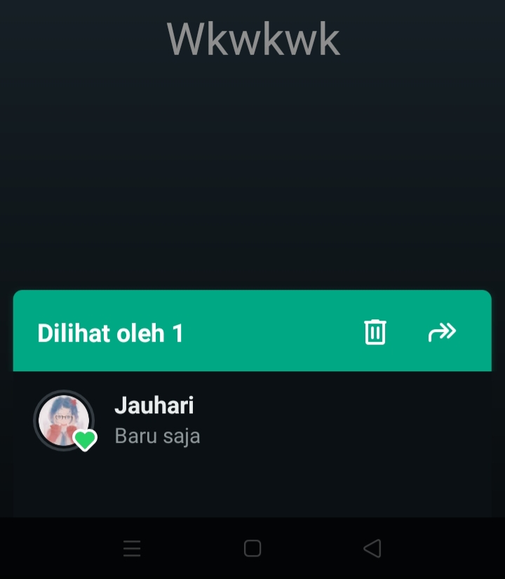
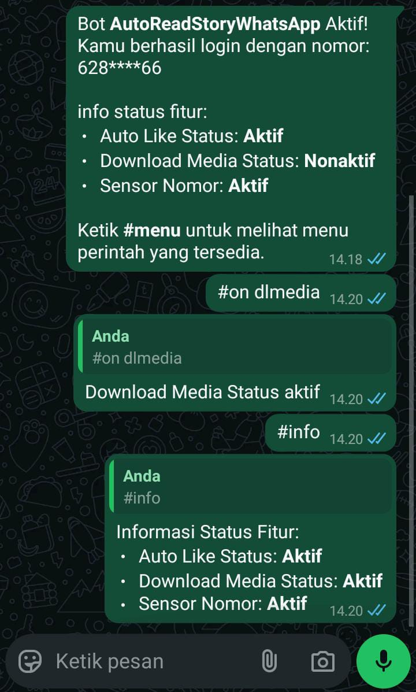

# Auto Reply WhatsApp
Auto Reply WhatsApp adalah bot yang berfungsi untuk membalas pesan grup secara otomatis dan memungkinkan kamu melihat, menyukai, dan mendownload status/story teman-teman WhatsAppmu secara otomatis, sehingga kamu menjadi orang pertamax yang melihat dan menyukai storynyaw.

<div align="center">
  
  <div>Melihat dan menyukai story secara otomatis</div>
  <br>
  
  <div>Mendownload media(foto, video, dan audio) dari story secara otomatis jika fitur downloadMediaStatus diaktifkan</div>
  <br>
  
  <div>Terdapat beberapa perintah (command) untuk mengaktifkan atau menonaktifkan fitur yang tersedia dengan mengetik #menu.</div>
</div>

## Fitur:
1. **Auto Like Status**: Menyukai status secara otomatis jika fitur ini diaktifkan.
2. **Download Media**: Mendownload media (foto, video, audio) dari status secara otomatis jika fitur ini diaktifkan.
3. **Sensor Nomor**: Menyensor nomor yang ada di dalam status jika fitur ini diaktifkan.
4. **Anti-Telpon**: Menolak panggilan telepon secara otomatis jika fitur ini diaktifkan.
5. **Blacklist**: Mengatur hanya nomor tertentu yang statusnya tidak akan dilihat.
6. **Whitelist**: Mengatur hanya nomor tertentu yang statusnya akan dilihat.
7. **Emojis**: Mengatur emoji yang digunakan untuk menyukai status.
8. **Grouplist**: Mengatur grup tertentu yang akan dibalas pesan-nya.

## Instalasi :
### Windows
1. Nodejs :<br>
   https://nodejs.org/id
2. Git    :<br>
   https://git-scm.com/downloads
### Ubuntu/Debian
1. Nodejs :
   ```bash
   curl -o- https://raw.githubusercontent.com/nvm-sh/nvm/v0.40.1/install.sh | bash && nvm install 22
   ```
   
2. Git :
   ```bash
   sudo apt update && sudo apt install -y git
   ```
   
### Termux (Android)
1. Nodejs + git :
   ```bash
   pkg update && pkg install git nodejs-lts
   ```

## Cara menjalankan bot :
1. Buka Terminal kesayangan kalian (⁠ ⁠╹⁠▽⁠╹⁠ ⁠) 👍
   
2. Clone repository dengan mengetik:
   ```bash
   git clone https://github.com/jauhariel/AutoReadStoryWhatsapp.git
   ```
3. Masuk ke dalam folder repository dengan mengetik:
   ```bash
   cd AutoReadStoryWhatsapp
   ```
4. Instal dependensi yang diperlukan dengan mengetik:
   ```bash
   npm i
   ```
5. Jalankan bot dengan mengetik:
   ```bash
   npm start
   ```
6. Enjoy
<hr>

## Catatan
```js
   {
    "autoLikeStatus": true, // ubah jadi false jika tidak ingin otomatis menyukai status
    "downloadMediaStatus": false, // ubah jadi true jika ingin mendownload media(foto, video, audio) dari status
    "sensorNomor": true, // ubah jadi false jika tidak ingin menyensor nomor yang ada di dalam status
    "antiTelpon": false, // ubah jadi true jika ingin mengaktifkan fitur anti-telepon
    "blackList": [ // nomor yang ada di dalam array ini tidak akan dilihat statusnya
        "628987654321",
        "628123456789"
    ],
    "whiteList": [], // jika array ini tidak kosong, hanya nomor yang ada di dalam array ini yang akan dilihat statusnya
    "emojis": [ // mengatur emoji yang digunakan untuk menyukai status
        "💚",
        "❤️",
        "👍"
    ]
   }
```
1. Kamu bisa menambahkan nomor yang tidak ingin kamu lihat story-nya secara otomatis di file <strong>config.json</strong> dengan menambahkan nomor pada array <strong>blackList</strong>.
   
2. Kamu bisa menambahkan hanya nomor tertentu yang ingin kamu lihat story-nya secara otomatis di file <strong>config.json</strong> dengan menambahkan nomor pada array <strong>whiteList</strong>.
   
3. Jika kamu ingin melihat story dari semua kontak, kosongkan array <strong>blackList</strong> dan <strong>whiteList</strong> yang ada di file <strong>config.json</strong>.

4. Ubah nilai <strong>autoLikeStatus</strong> yang terdapat di file <strong>config.json</strong> menjadi false untuk menonaktifkan fitur auto-like pada status, atau ubah menjadi true untuk mengaktifkannya.

5. Ubah nilai <strong>downloadMediaStatus</strong> yang terdapat di file <strong>config.json</strong> menjadi true untuk secara otomatis mendownload media (foto, video, audio) dari status, atau ubah menjadi false untuk menonaktifkan fitur tersebut.

6. Ubah nilai <strong>antiTelpon</strong> yang terdapat di file <strong>config.json</strong> menjadi true untuk mengaktifkan fitur anti-telepon, atau ubah menjadi false untuk menonaktifkannya.

7. Ubah nilai <strong>emojis</strong> yang terdapat di file <strong>config.json</strong> untuk mengatur emoji yang digunakan untuk menyukai status. Kamu bisa menambahkan atau mengubah emoji sesuai keinginan.

8. Klik <strong>CTRL</strong> dan <strong>C</strong> pada keyboard secara bersamaan untuk memberhentikan bot!
   
9. Hapus folder <strong>sessions</strong> jika ingin login dengan nomor lain atau jika terjadi masalah login, seperti stuck di 'menghubungkan ke wangsaf', lalu jalankan ulang dengan mengetik:
   ```bash
   npm start
   ```