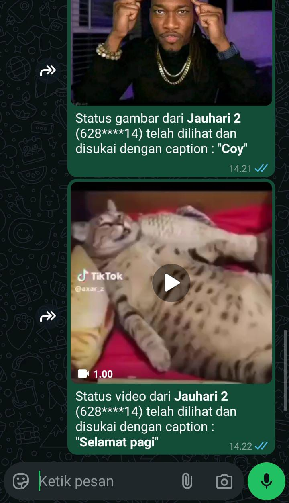

# Auto Read Story Whatsapp
Auto Read Story/Status WhatsApp adalah bot sederhana yang memungkinkan kamu melihat, menyukai, dan mendownload status/story teman-teman WhatsAppmu secara otomatis, sehingga kamu menjadi orang pertamax yang melihat dan menyukai storynyaw.

<div align="center">
  
  <div>Melihat dan menyukai story secara otomatis</div>
  <br>
  
  <div>Mendownload media(foto, video, dan audio) dari story secara otomatis jika fitur downloadMediaStatus diaktifkan</div>
</div>

## Instalasi :
### Windows
1. Nodejs :<br>
   https://nodejs.org/id
2. Git    :<br>
   https://git-scm.com/downloads
### Ubuntu/Debian
1. Nodejs :
   ```bash
   curl -o- https://raw.githubusercontent.com/nvm-sh/nvm/v0.40.1/install.sh | bash && nvm install 22
   ```
   
2. Git :
   ```bash
   sudo apt update && sudo apt install -y git
   ```
   
### Termux (Android)
1. Nodejs + git :
   ```bash
   pkg update && pkg install git nodejs-lts
   ```

## Cara menjalankan bot :
1. Buka Terminal kesayangan kalian (⁠ ⁠╹⁠▽⁠╹⁠ ⁠) 👍
   
2. Clone repository dengan mengetik:
   ```bash
   git clone https://github.com/jauhariel/AutoReadStoryWhatsapp.git
   ```
3. Masuk ke dalam folder repository dengan mengetik:
   ```bash
   cd AutoReadStoryWhatsapp
   ```
4. Instal dependensi yang diperlukan dengan mengetik:
   ```bash
   npm i
   ```
5. Jalankan bot dengan mengetik:
   ```bash
   npm start
   ```
6. Enjoy
<hr>

## Catatan
1. Kamu bisa menambahkan nomor yang tidak ingin kamu lihat story-nya secara otomatis di file <strong>config.js</strong> dengan menambahkan nomor pada variabel array <strong>blackList</strong>.
   
2. Kamu bisa menambahkan hanya nomor tertentu yang ingin kamu lihat story-nya secara otomatis di file <strong>config.js</strong> dengan menambahkan nomor pada variabel array <strong>whiteList</strong>.
   
3. Jika kamu ingin melihat story dari semua kontak, kosongkan variabel array <strong>blackList</strong> dan <strong>whiteList</strong> yang ada di file <strong>config.js</strong>.

4. Ubah nilai variabel <strong>autoLikeStatus</strong> yang terdapat di file <strong>config.js</strong> menjadi false untuk menonaktifkan fitur auto-like pada status, atau ubah menjadi true untuk mengaktifkannya.

5. Ubah nilai variabel <strong>downloadMediaStatus</strong> yang terdapat di file <strong>config.js</strong> menjadi true untuk secara otomatis mendownload media (foto, video, audio) dari status, atau ubah menjadi false untuk menonaktifkan fitur tersebut.

6. Klik <strong>CTRL</strong> dan <strong>C</strong> pada keyboard secara bersamaan untuk memberhentikan bot!
   
7. Hapus folder <strong>sessions</strong> jika ingin login dengan nomor lain atau jika terjadi masalah login, seperti stuck di 'menghubungkan ke wangsaf', lalu jalankan ulang dengan mengetik:
   ```bash
   npm start
   ```
